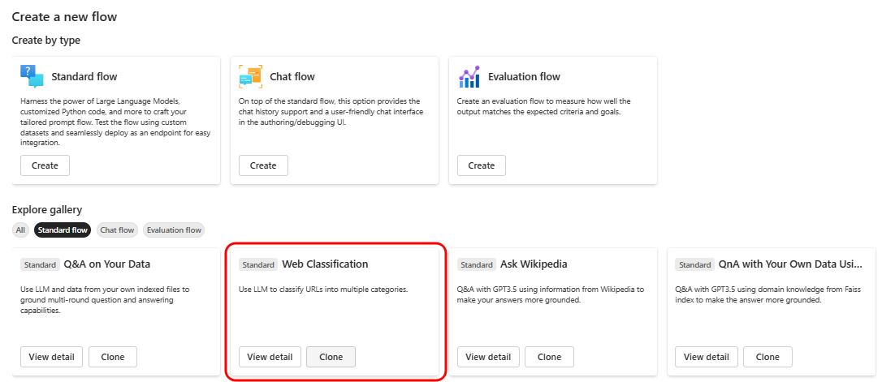
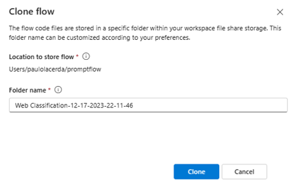
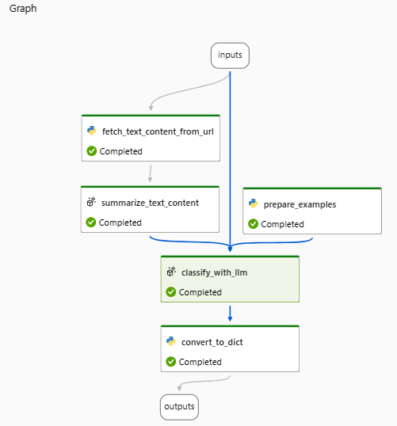
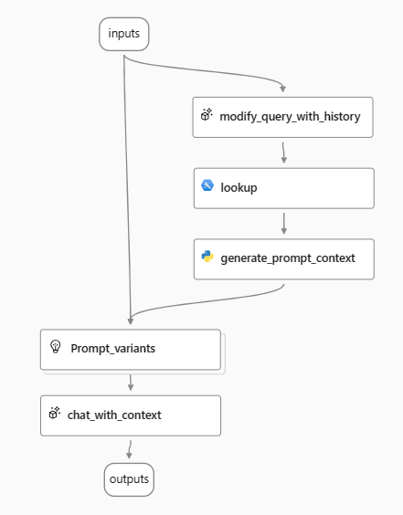
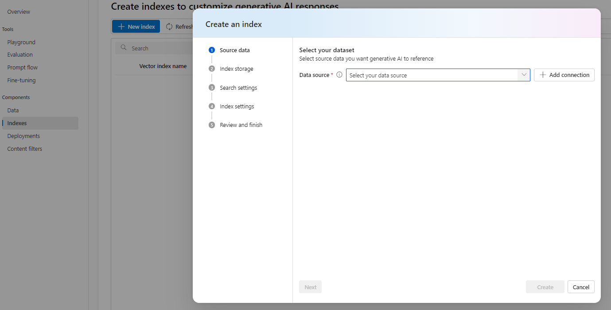
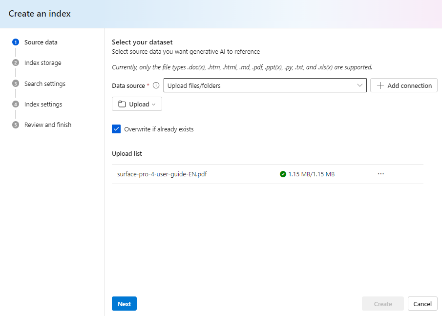
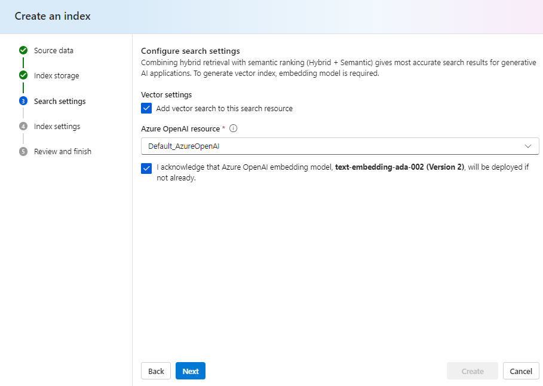
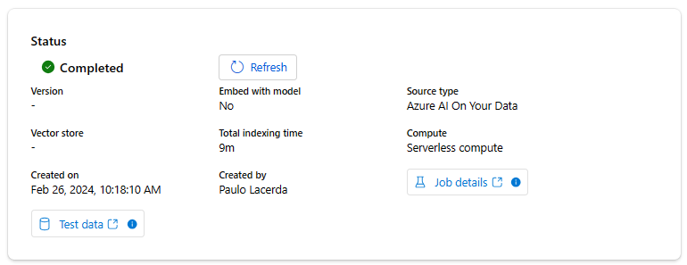
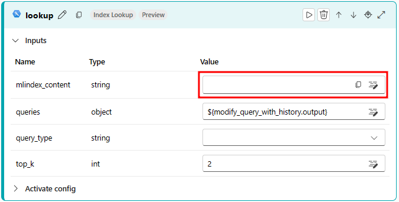
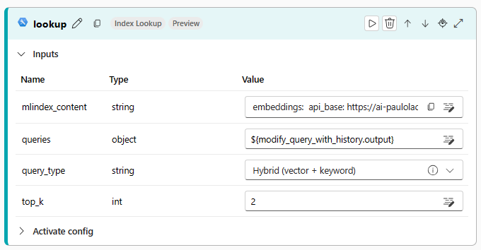

#### Building LLMs Orchestration Flows

Learn how to build prompt flow orchestrations for your LLM App.

#### Prerequisites

An Azure subscription where you can create an AI Hub Resource and a AI Search service.

#### Setup

If you are running this Lab after lesson 1, you don't need to worry about this step. Otherwise, follow **Setup** from **Lesson 1** to create a project and its associated resources in Azure AI Studio, as well as to deploy the GPT-4 model.

#### Lab Steps

During this lab, we will cover the following steps:

1) Create a standard classification flow.
2) Create a conversational RAG flow.

##### 1) Create a standard classification flow

Open your web browser and navigate to: https://ai.azure.com

Select the AI project that you created during the setup. Then, in the **Build** menu, select the **Prompt flow** option and click on the blue **Create** button.

We will create a Standard flow for classifying websites on the internet.

In the flow creation window, select the **Standard flow** filter in the **Explore gallery** section.

Then, click on the **Clone** button in the Web Classification box.

Use the default name for the flow, or if you prefer, define a name of your preference and click on **Clone**.

A Standard flow will be created with the following structure:

Notice that the flow has five nodes, the first `fetch_text_content_from_url` is a python node to extract the text from a Web page.

Then the content obtained by the extraction serves as input for an LLM node `summarize_text_content` to summarize the content.

The summarization, combined with the classification examples generated by a python node `prepare_examples` is the input for another LLM node `classify_with_llm` where the classification is performed.

At the end, we have a Python node `convert_to_dict` responsible for formatting the output of the flow in a python dictionary format.

Now that the flow has been created, we need a runtime to execute it in the Prompt Flow.

Select **Start** in the runtime dropdown to start a runtime to run your flow:

After starting the Runtime, we need to define the Connection with the LLM for each LLM step. In our case, these are `summarize_text_content` and `classify_with_llm`.

We will use the `Default_AzureOpenAI` Connection, which connects to the Azure OpenAI resource that was created when the Azure AI project was set up. 

Select `gpt-4` in the deployment_name. This deployment was created during Setup.

Associate the same Connection for the `classify_with_llm` step:

> Note: you can leave the `response_format` field in blank or select the `{"type":"text"}`.

Once the Runtime is selected and the Connections are configured, you can start the flow by clicking the **Run** button at the top of the page.

The input required for the flow execution is specified in its input section.

After finishing the execution you will see that the flow is complete with all steps.

You can view the result of the processing by clicking the last node.

##### 2) Create a conversational RAG flow

Now you will create a conversational flow using the RAG pattern, start by creating a new flow in the **Prompt Flow** item in the **Tools** section within the **Build** tab.

Select the **Multi-Round Q&A** on Your Data template after clicking the **Create** button.

Click on the **Clone** button. A flow with the following structure will be created.

Start the automatic runtime by selecting **Start** in the **Runtime** drop down. The runtime will be useful for you to work with the flow moving forward.

Click the **Save** button to save your flow.

###### 2.1) Flow overview

The first node, `modify_query_with_history`, produces a search query using the user's question and their previous interactions. Next, in the `lookup` node, the flow uses the vector index to conduct a search within a vector store, which is where the RAG pattern retrieval step takes place. Following the search process, the `generate_prompt_context` node consolidates the results into a string. This string then serves as input for the `Prompt_variants` node, which formulates various prompts. Finally, these prompts are used to generate the user's answer in the `chat_with_context` node.

###### 2.2) Search index

Before you can start running your flow, a crucial step is to establish the search index for the Retrieval stage. This search index will be provided by the Azure AI Search service.

The AI Search service was originally created in the **Setup** section of this lab. If you have not yet created the Search service, you will need to set one up as explained below. With the search service created, you can now proceed to create the index.

In our case, we will create a **Vector index**. To do this, you just need to go back to the project in the **AI Studio**, select the **Indexes** option, and then click on the **New index** button.  
   

   
At the `Source data` stage, select the `Upload files/folders` option and upload the PDF `files/surface-pro-4-user-guide-EN.pdf` to the data folder of this lab, as shown in the next screen.  
   

   
In `Index storage`, select the Search Service you created earlier.  

> If someone has created the AI Search service for you, you can also use it to create the index. Simply select it in the **Select Azure AI Search service** option.

   
Under `Search settings`, select **Add vector search to this ...** as indicated in the following image.  
   

   
In `Index settings`, keep the default options as indicated below.  
   

   
> Note: If you want to select a virtual machine configuration, click on the **Select from recommended options**. If you don't select, the default configuration will use serverless processing.

Great, now just click on the **Create** button at the `Review and finish` stage.  
   
The indexing job will be created and submitted for execution, so please wait a while for it to complete.

It may take about 10 minutes from the time it enters the execution queue until it starts.  
   
Wait until the index status is `Completed` as in the next image, before proceeding with the next steps.  
   

Done! You have created the index, as can be seen in the **Indexes** item of the **Components** section.

Now return to the RAG flow created in **Prompt flow** to configure the `lookup` node.

After selecting the `lookup` node, click on `mlindex_content`.

A **Generate** window will appear. In this window, select the `Registered Index` option from the `index_type` field. Then, choose version 1 of the index you just created, as shown in the following image. After making these selections, click on **Save**.

Now, let's go back to the `lookup` node. Select the `Hybrid (vector + keyword)` option from the query_type field, as shown in the subsequent image.

###### 2.3) Updating connection information

Now you will need to update the Connections of the nodes that link with LLM models.  

Starting with the Connection in the `modify_query_with_history` node with the gpt-4 deployment, as indicated below:

And the Connection for the `chat_with_context node` with the gpt-4 deployment, as indicated below:

###### 2.4) Testing your RAG flow

Everything is now set up for you to initiate your chat flow. Simply click on the blue **Chat** button located at the top right corner of your page to begin interacting with the flow.

